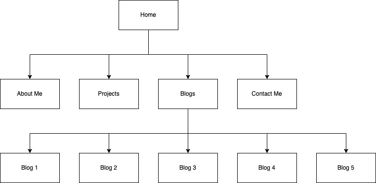
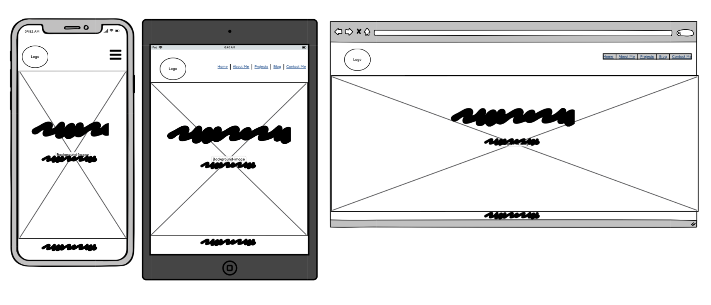
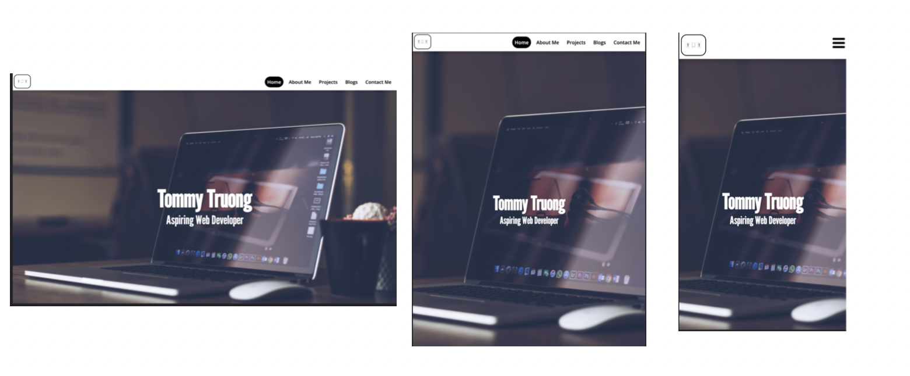
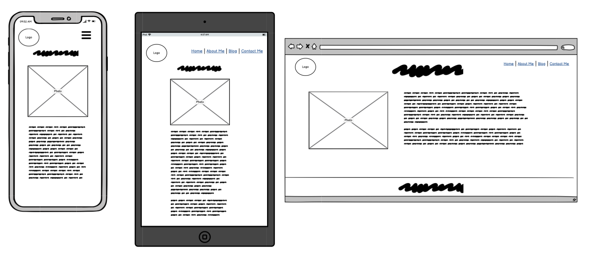
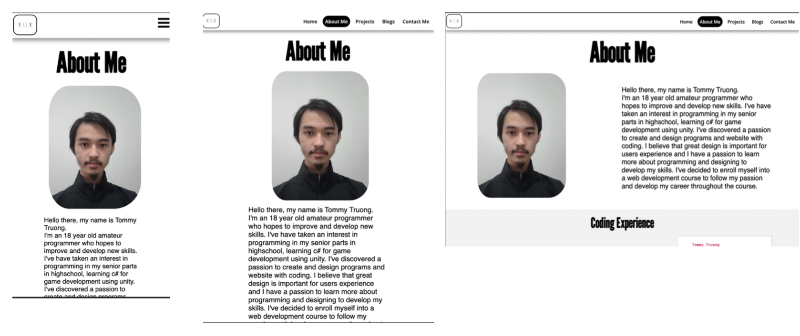

# Portfolio Documentation

----

[Link to portfolio website](https://asianboi11.github.io/TommyTruong_T1A2/index.html)

[Link to website repo](https://github.com/ASIANBOI11/TommyTruong_T1A2)

----

## Purpose
The purpose of my portfolio website is to showcase my ability to plan, design and create a website through HTML and CSS, while providing my background, coding experience and projects.

---

## Target Audience
My website portfolio is designed to attract employers in the IT field with the aim of showcasing my skills of planning and designing a website.

---

## Functionality/Features
The function of the website is simple and clean with minimalist design theme while providing full sematic HTML and fully responsive deisgn between phone, tablet and desktop. The colour scheme is for the website is a simple black and white theme with a hint of whitish grey to make the users experience simple and easy. The website is navigated by the navigation bar at the top of the page. There are 5 pages in the website:

  
* Home: The introdction page that shows my full name and below my asiparation.
* About Me: Introduces who I am, my passion, my experience in coding and resume.
* Projects: Showcases my past projects I've worked on to demonstrate my skills technology.
* Blogs: A page showcasing 5 blogs that is linked with their story.
* Contact Me: Shows my contact details(Email and Phone Number) and links my socials such as LinkedIn, Instagram, Twitter and Github.

---

## Sitemaps
Created from Balsamiq Wireframes software

---
## Wireframes and Screenshots
---

### Home Page:

### About Me

### Projects

